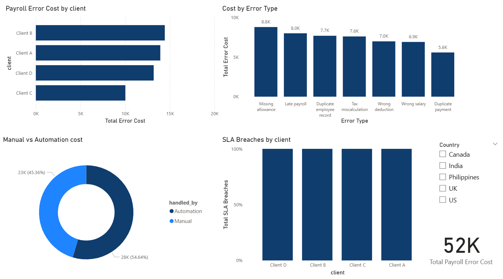

# Payroll Error & Cost Impact Analysis
 
## Problem Statement
Payroll errors lead to financial loss, rework, and SLA breaches. This project analyzes payroll error data across multiple clients and countries to identify high-cost error types and process risk areas.
 
## Tools Used
- Microsoft Excel
- Power BI
 
## Key Analysis
- Client-wise payroll error cost analysis
- Error type impact assessment
- Manual vs automation cost comparison
- SLA breach identification
- Country-level filtering using slicers
 
## Key Insights
- A small number of clients contribute disproportionately to payroll error costs.
- Manual handling accounts for the majority of payroll error costs.
- Post-pay errors are significantly more expensive than pre-pay errors.
- Certain clients show recurring SLA breach risks.
 
## Outcome
The analysis highlights automation and early validation controls as key levers to reduce payroll error costs and improve SLA performance.

